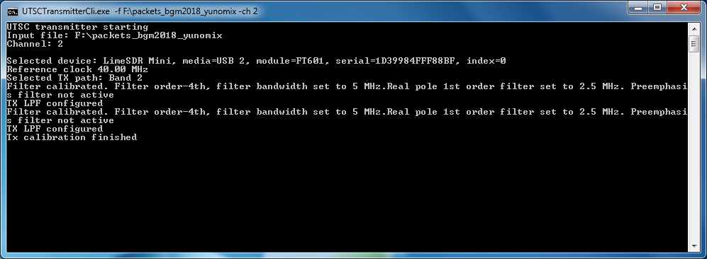
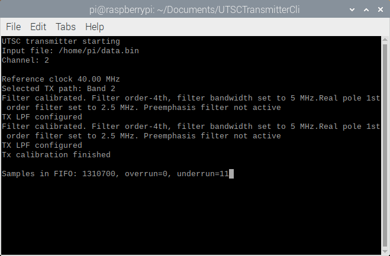

# UTSCTransmitterCli
A QPSK transmitter for broadcasting UTSC with a LimeSDR or LimeSDR Mini. Takes an input file and broadcasts it with the proper QPSK parameters. Intended for UTSC streams but works with any file.

#### How to use (Windows 7 or higher, 64-bit)

Make sure the FTDI driver is installed for the Lime device you want to use.

In the Windows subfolder there is a Visual Studio 2017 project folder called UTSCTransmitterCli. To run the program, open a command prompt and run UTSCTransmitterCli.exe. You can find it in UTSCTransmitterCli\x64\Release\.

The only required argument is -f for an input file.



#### How to use (Raspberry Pi 3B running Raspbian)

No driver is needed, but you might have to install LimeSuite. Use the "How to build (Linux)" instructions in the next section if necessary.

You can find a precompiled binary in the Linux\pi_3b subfolder. Open a terminal, change to the pi_3b folder, and run it like this:

```
./UTSCTransmitterCli -f [filename]
```

If you want to see if there are buffer underruns, use the -v or -vu flag.

```
./UTSCTransmitterCli -f [filename] -vu
```



#### How to build (Linux)

No driver is needed for Linux, but you'll need to install or build LimeSuite. I wanted to use it on the Raspberry Pi which has an ARM CPU so I had to build it from source.

If you want to use a Linux x86/x64 PC, you might be able to install it with these instructions: [Installing Lime Suite on Linux](https://wiki.myriadrf.org/Installing_Lime_Suite_on_Linux). The rest of the Linux build instructions are mostly copied from there.

Building LimeSuite is easy and required if you want to use it on a Raspberry Pi, because it has an ARM CPU. Run these commands to build it.

If you're using a PC instead of a Raspberry Pi, run this:

```
sudo add-apt-repository -y ppa:myriadrf/drivers
sudo apt update
```

Then run this regardless of computer type:

```
sudo apt install libsoapysdr-dev libi2c-dev libusb-1.0-0-dev git g++ cmake libsqlite3-dev libwxgtk3.0-dev freeglut3-dev
```

Try to fix any issues so these dependencies can be installed. If this command fails and you can't fix it then just move on.

Run these commands to build and install LimeSuite.

```
git clone https://github.com/myriadrf/LimeSuite.git
cd LimeSuite
git checkout stable
mkdir builddir
cd builddir
cmake ../
make -j2
sudo make install
sudo ldconfig
cd ../udev-rules
sudo bash install.sh
```

My Raspberry Pi became unresponsive and didn't appear to be making progress when I used "make -j$(nproc)" so I changed it to "make -j2". You can use -j$(nproc) on a PC if you want, or a Raspberry Pi if it works for you.

When the build process finishes, it will install some shortcuts to the development files needed for the C++ API. The "include" folder will be accessible during the build process but the "lib" folder won't by default, so its location has to be specified in the build command (shown below).

Change to the Linux subfolder (in this repository) and use g++ as shown to compile the transmitter.

```
sudo g++ -pthread -o UTSCTransmitterCli UTSCTransmitterCli.cpp /usr/local/lib/libLimeSuite.so
```

Run the transmitter like this:

```
./UTSCTransmitterCli -f [filename]
```

#### Command-line options

-f [file to broadcast]

-ch [channel to broadcast on (1-30 inclusive), default is 1]

-v or -verbose (shows the buffer status), default is false

-vu or -verboseunderrun (shows the buffer status only for underruns), default is false

-l or -list (lists all connected Lime devices)

-d or -device [device string (from the list provided by -l or -list), defaults to the first device]

-g or -gain [transmit gain (0.01-1.0 inclusive), default 1.0]

-h or -? or /? or -help (shows this help message)
